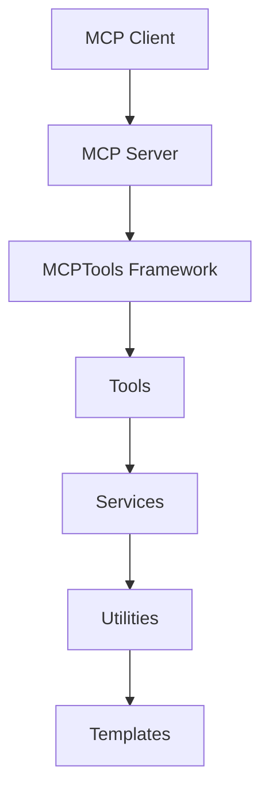
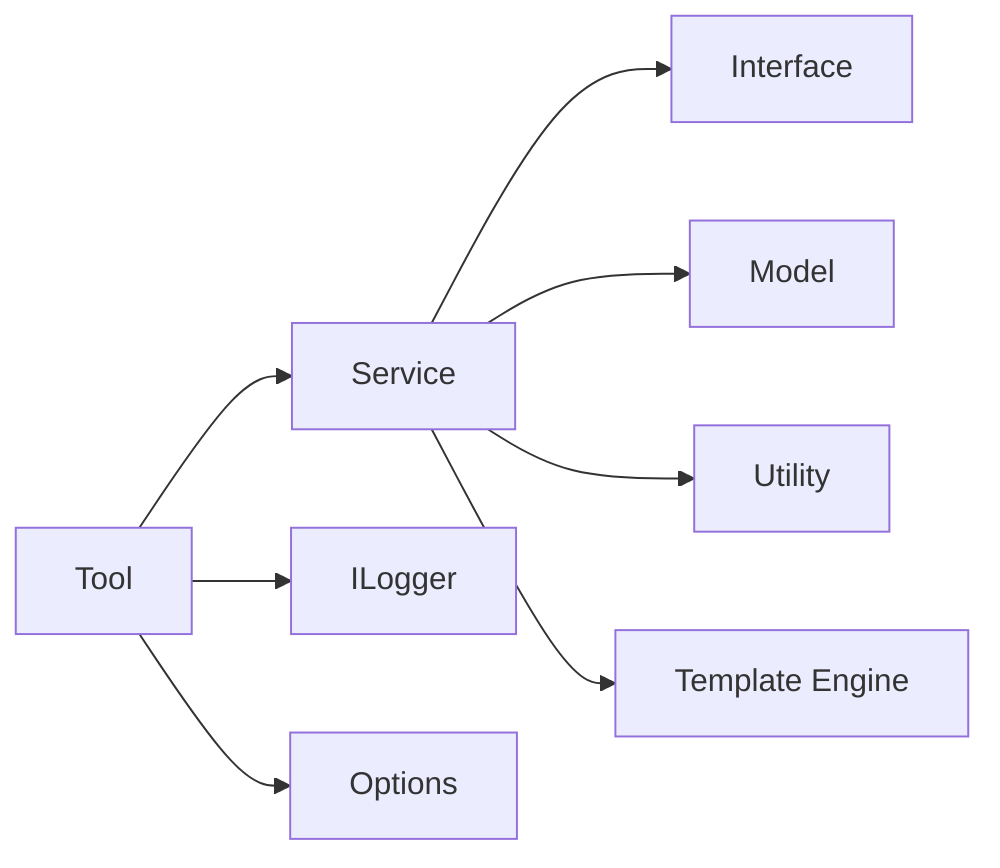
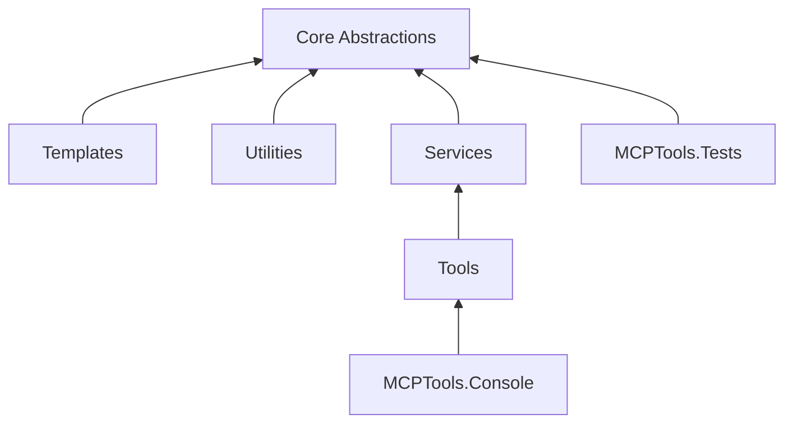
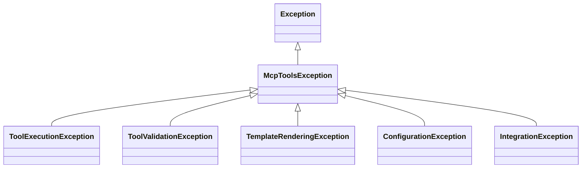
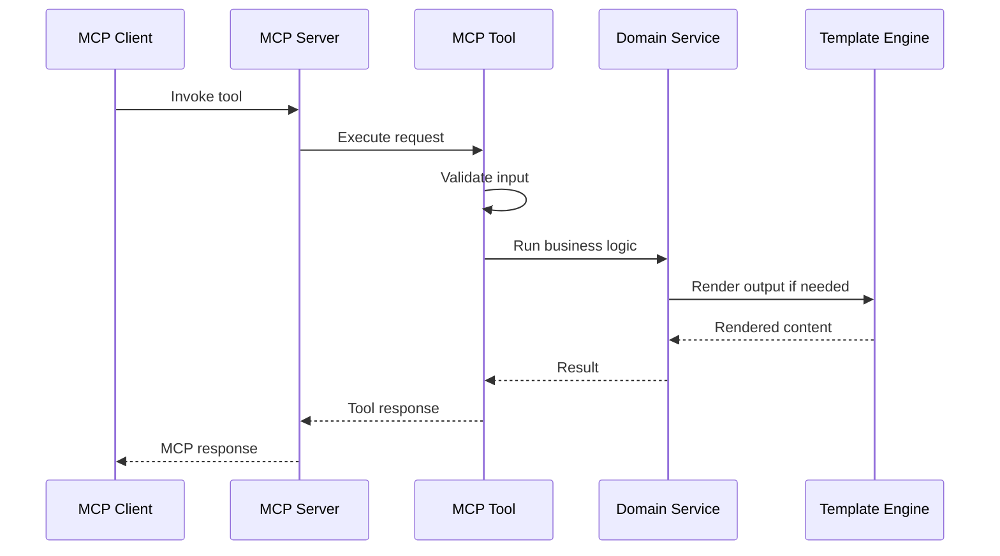
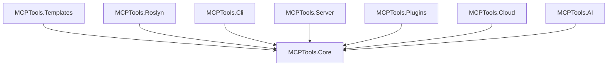

# MCPTools Architecture

## 1. Introduction

### Purpose

This document defines the architecture for **MCPTools**, an open-source .NET 10 framework for building reusable Model Context Protocol (MCP) tools and developer automation utilities.

The architecture is intended to provide a stable foundation for tool builders, contributors, and maintainers. It describes the major layers, project structure, dependency rules, extension points, and implementation strategies that guide the framework.

### Scope

MCPTools is designed to support reusable tooling scenarios such as:

- Code generation.
- Database tools.
- File system tools.
- Project analysis.
- Documentation generation.
- Template engine workflows.
- AI utilities.

MCPTools is **AI-platform independent**. It should be usable from Claude Code, ChatGPT, GitHub Copilot, or any future MCP-compatible client without coupling the framework to a specific provider or assistant experience.

## 2. Architectural Goals

| Goal | Description |
| --- | --- |
| Extensibility | New tools, services, providers, templates, and integrations should be added without changing framework internals. |
| Maintainability | The codebase should remain understandable, modular, well-named, and aligned with common .NET practices. |
| Testability | Tools and services should be testable without requiring a live MCP client, external AI provider, or production environment. |
| Reusability | Core abstractions and utilities should support reuse across multiple tools, projects, and host applications. |
| Performance | The framework should avoid unnecessary allocations, blocking calls, and heavy dependencies in the core runtime path. |
| Simplicity | The architecture should favor clear contracts, small components, and predictable conventions over excessive abstraction. |

## 3. Design Principles

### SOLID

MCPTools follows SOLID principles to keep the framework modular and maintainable:

- **Single Responsibility Principle:** each class, service, and tool should have one reason to change.
- **Open/Closed Principle:** new behavior should be added through extension points rather than modification of stable code.
- **Liskov Substitution Principle:** implementations should honor the contracts defined by their abstractions.
- **Interface Segregation Principle:** interfaces should remain focused and should not force consumers to depend on unused members.
- **Dependency Inversion Principle:** high-level modules should depend on abstractions rather than concrete implementations.

### Clean Architecture

The framework separates core business logic from infrastructure, transport, hosting, and client-specific concerns. Tool behavior should be executable independently from the MCP server or any AI client.

### Separation of Concerns

Each layer has a clear responsibility. MCP protocol handling, tool execution, service orchestration, template rendering, logging, configuration, and error handling should remain separated.

### Composition Over Inheritance

Reusable behavior should be built by composing small services and abstractions. Inheritance should be reserved for cases where it provides clear semantic value.

### Dependency Injection

Services, tools, configuration objects, and framework components should be registered through dependency injection. This enables testability, replacement, and host integration.

### Convention Over Configuration

MCPTools should provide sensible defaults for naming, registration, folder structure, and common tool patterns while still allowing advanced customization.

## 4. High-Level Architecture



### Layer Responsibilities

| Layer | Responsibility |
| --- | --- |
| MCP Client | External client that discovers and invokes MCP tools. Examples include Claude Code, ChatGPT, GitHub Copilot, or any MCP-compatible client. |
| MCP Server | Hosts MCP endpoints, exposes tool metadata, receives requests, and returns tool responses. |
| MCPTools Framework | Provides abstractions, registration patterns, execution infrastructure, shared services, validation, logging, and configuration support. |
| Tools | User-facing capabilities exposed through MCP. A tool represents a focused operation such as generating code, analyzing a project, or querying database metadata. |
| Services | Application and domain services that implement reusable business logic behind tools. |
| Utilities | Shared helpers for file access, naming, formatting, serialization, validation, reflection, and other low-level concerns. |
| Templates | Reusable text, code, documentation, and output templates used by tools and services. |

### Architectural Intent

MCPTools should keep MCP protocol concerns at the boundary. Tool logic should remain ordinary .NET code that can be tested, reused, and hosted outside a specific MCP client.

## 5. Solution Structure

Recommended repository layout:

```text
MCPTools/
|-- MCPTools.sln
|-- src/
|   |-- MCPTools.Core/
|   |-- MCPTools.Console/
|   |-- MCPTools.Tests/
|-- docs/
|-- samples/
```

Current repository layout may place projects directly at the repository root during early development. As the framework matures, the `src/`, `docs/`, and `samples/` folders should be adopted for clearer separation.

### Project and Folder Responsibilities

| Path | Purpose |
| --- | --- |
| `MCPTools.sln` | Main solution file that groups framework projects, tests, samples, and related tooling. |
| `src/MCPTools.Core` | Core framework library containing abstractions, interfaces, models, tool contracts, services, options, exceptions, and extension methods. |
| `src/MCPTools.Console` | Console host used for local execution, experimentation, sample workflows, diagnostics, and development-time validation. |
| `src/MCPTools.Tests` | Automated test project covering core abstractions, services, tool behavior, validation, and extension points. |
| `docs/` | Architecture, design decisions, usage guides, contribution guidance, standards, and framework documentation. |
| `samples/` | Example MCP tools, sample hosts, reference integrations, and demonstration projects. |

## 6. Core Components

### Tools

Tools are the primary capabilities exposed to MCP clients. Each tool should have a clear name, input contract, output contract, validation behavior, and execution path.

Examples:

- Generate a class from a template.
- Analyze a .NET project structure.
- Read database schema metadata.
- Generate API documentation.

### Services

Services contain reusable application logic used by tools. They should be independent of MCP transport concerns and should be easy to test with mocked dependencies.

### Template Engine

The template engine is responsible for rendering repeatable outputs such as source code, documentation, configuration files, and reports. It should support structured input models, reusable templates, and deterministic output.

### Configuration

Configuration provides runtime settings for framework behavior, tool options, templates, logging, and integration-specific settings. Configuration should be modeled with strongly typed options.

### Logging

Logging provides observability across tool registration, validation, execution, failures, and diagnostics. MCPTools uses standard .NET logging abstractions through `ILogger`.

### Utilities

Utilities provide shared low-level helpers. They should be small, deterministic, and free from unnecessary business logic.

### Models

Models represent inputs, outputs, metadata, options, tool descriptors, validation results, and domain-specific data structures.

### Exceptions

Exceptions represent known failure modes in a consistent hierarchy. They should make failures understandable to framework users and host applications.

### Extensions

Extensions provide convenient registration and configuration APIs, usually through extension methods for `IServiceCollection`, configuration builders, or tool registries.

### Interfaces

Interfaces define focused contracts for tools, services, renderers, validators, providers, and framework infrastructure.

### Abstractions

Abstractions define the stable architectural boundaries of the framework. They allow implementations to evolve while preserving compatibility for tool authors and host applications.



## 7. Dependency Rules

### Allowed Dependencies

| Source Layer | May Reference | Must Not Reference |
| --- | --- | --- |
| Tools | Services, interfaces, models, options, logging abstractions | MCP client-specific SDKs, concrete host implementations |
| Services | Interfaces, models, utilities, template engine abstractions | Tools, MCP client-specific concerns |
| Utilities | Framework-neutral primitives and models | Tools, services, host applications |
| Templates | Models and template rendering abstractions | Tools, MCP clients, host-specific services |
| Console Host | Core framework, sample tools, configuration, logging | Internal test-only code |
| Tests | All public framework APIs and test helpers | Production-only secrets or live external dependencies by default |

### Dependency Direction



Dependencies should point inward toward stable abstractions. Higher-level workflows may depend on lower-level services, but lower-level components must not depend on higher-level tools or host applications.

### Circular Dependencies

Circular dependencies must be avoided because they:

- Make components harder to test and replace.
- Increase build complexity.
- Hide architectural ownership boundaries.
- Encourage tight coupling between unrelated features.
- Make future modular packaging more difficult.

When two components appear to need each other, introduce a smaller shared abstraction or split responsibilities into separate services.

## 8. Dependency Injection Strategy

MCPTools should use standard .NET dependency injection through `Microsoft.Extensions.DependencyInjection`.

### Registration Guidelines

- Register framework services through `IServiceCollection` extension methods.
- Register tools through explicit tool registration APIs or discoverable conventions.
- Register options through strongly typed configuration binding.
- Prefer scoped or transient lifetimes for execution-specific services.
- Use singleton lifetimes only for stateless, thread-safe components.

Example registration shape:

```csharp
services
    .AddMcpTools(options =>
    {
        options.EnableTemplateEngine = true;
    })
    .AddMcpTool<ProjectAnalysisTool>()
    .AddMcpTool<CodeGenerationTool>();
```

### Constructor Injection

Constructor injection is preferred because it:

- Makes dependencies explicit.
- Supports unit testing.
- Avoids hidden service locator behavior.
- Encourages immutable object design.
- Allows the container to validate dependency graphs early.

Property injection and direct container access should be avoided except for rare integration scenarios.

## 9. Logging Strategy

MCPTools uses centralized logging through `ILogger<T>`.

Logging should be applied consistently across:

- Tool registration.
- Tool invocation.
- Input validation.
- Template rendering.
- File and database operations.
- Integration boundaries.
- Exceptions and failed operations.

### Structured Logging

Logs should use structured message templates instead of string interpolation.

```csharp
logger.LogInformation(
    "Executing tool {ToolName} with request id {RequestId}",
    toolName,
    requestId);
```

Structured logging improves filtering, correlation, diagnostics, and integration with observability platforms.

Sensitive values such as secrets, tokens, credentials, and private user data must not be logged.

## 10. Configuration Strategy

MCPTools should use standard .NET configuration sources such as:

- `appsettings.json`.
- `appsettings.{Environment}.json`.
- Environment variables.
- User secrets for local development.
- Host-provided configuration.

Framework configuration should be represented with strongly typed options.

```csharp
public sealed class McpToolsOptions
{
    public bool EnableTemplateEngine { get; set; } = true;
    public string DefaultTemplatePath { get; set; } = "Templates";
}
```

Options should be validated during startup where possible. Invalid configuration should fail early with clear messages.

## 11. Error Handling Strategy

MCPTools should define a clear exception hierarchy for known framework failures.



### Validation Exceptions

Validation exceptions represent expected input or configuration problems. They should be clear, actionable, and safe to return to a caller when appropriate.

Examples:

- Missing required tool input.
- Invalid template name.
- Unsupported project type.
- Invalid database connection configuration.

### Unexpected Exceptions

Unexpected exceptions represent failures that were not part of normal validation flow.

Examples:

- I/O failures.
- Serialization failures.
- Unhandled integration errors.
- Runtime exceptions from third-party dependencies.

Unexpected exceptions should be logged with sufficient diagnostic context and translated into safe error responses at the framework boundary.

## 12. Extensibility

MCPTools should allow new tools to be added without modifying the core framework.

### Tool Extension Model

A new tool should typically require:

1. A request model.
2. A response model.
3. A tool implementation.
4. Any required services.
5. Registration through dependency injection.
6. Tests for validation and execution behavior.



### Plugin-Friendly Architecture

The framework should support future plugin scenarios by keeping contracts stable and implementations replaceable.

Plugin-friendly design requires:

- Stable public abstractions.
- Minimal assumptions about assembly loading.
- Clear registration APIs.
- Isolated optional dependencies.
- Version-aware extension packages.
- No dependency on a specific AI client.

## 13. Future Architecture

MCPTools should be designed to support future capabilities without disrupting the core framework.

| Future Area | Architectural Direction |
| --- | --- |
| Roslyn | Add optional packages for source analysis, code generation, syntax transformation, and project inspection. |
| CLI | Provide a command-line interface for local execution, scaffolding, diagnostics, and tool testing. |
| Plugin System | Support external tool packages with discovery, registration, metadata, and version compatibility. |
| MCP Server | Provide a reference MCP server host or integration package while keeping the core framework server-agnostic. |
| AI Integrations | Add optional provider-specific adapters only when they are isolated from the core and remain replaceable. |
| Cloud Integrations | Add optional modules for cloud storage, deployment metadata, repository services, and hosted automation workflows. |

### Future Package Direction



Optional packages may depend on `MCPTools.Core`, but `MCPTools.Core` must not depend on optional packages.

## 14. Architecture Summary

MCPTools is designed as a modular, testable, platform-neutral .NET 10 framework for building MCP tools and developer automation.

The architecture follows SOLID principles, Clean Architecture, dependency injection, clear separation of concerns, and convention-based extensibility. The framework core should remain lightweight and stable, while specialized capabilities such as Roslyn, CLI support, cloud integrations, plugin loading, and AI provider adapters should be delivered through optional modules.

The central architectural principle is simple: **tool logic should remain reusable .NET code, independent of any specific AI client or hosting environment**.

This approach allows MCPTools to serve as a durable foundation for open-source and enterprise-grade MCP tooling across current and future MCP-compatible clients.
