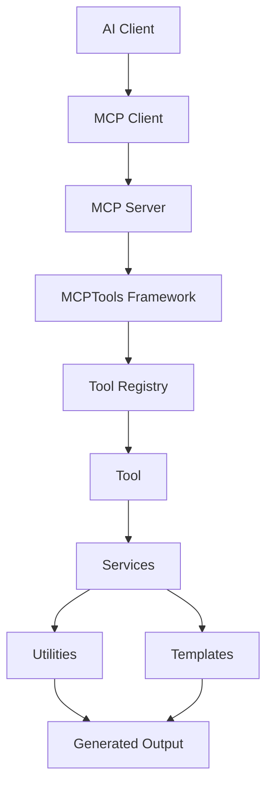
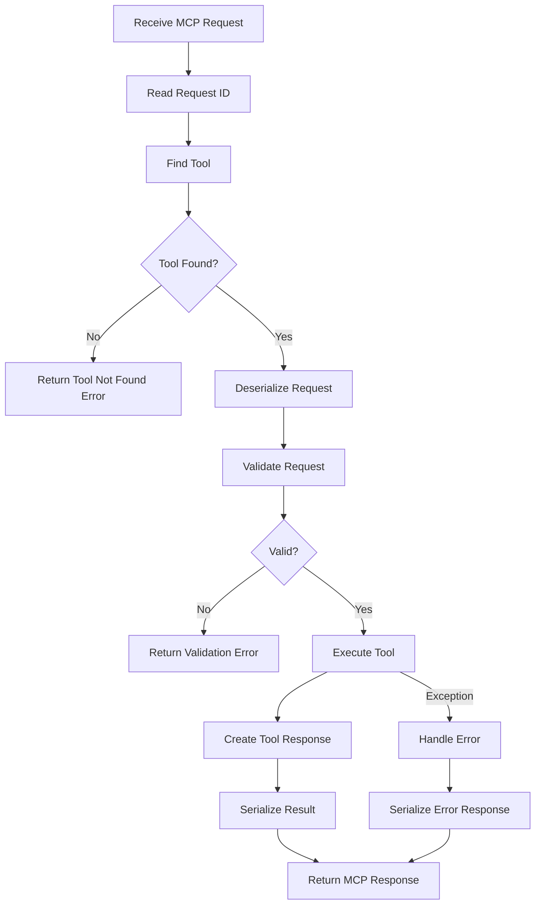

# MCPTools MCP Integration

## 1. Introduction

### What Is Model Context Protocol?

The **Model Context Protocol (MCP)** is an open protocol that allows AI-enabled clients and applications to discover and invoke external tools, resources, and contextual capabilities through a consistent interface.

MCP provides a standardized way for a client to ask an external server what capabilities are available, what inputs those capabilities require, and how to execute them.

### Why MCP Exists

MCP exists to reduce custom integration work between AI clients and external systems.

Without a protocol boundary, every AI client and every tool provider must create custom integrations. MCP creates a shared contract so tools can be exposed once and used by any compatible client.

MCP enables:

- Tool discovery.
- Structured tool input and output.
- Reusable automation capabilities.
- Client-independent integrations.
- Clear separation between AI clients and external execution environments.

### Role of MCPTools

**MCPTools** is a reusable .NET 10 framework for building MCP-compatible tools and developer automation utilities.

MCPTools is not itself an MCP server. Instead, it provides the internal framework components that an MCP server can host:

- Tool abstractions.
- Tool registration.
- Tool metadata.
- Tool validation.
- Tool execution infrastructure.
- Services and utilities.
- Template-based artifact generation.

MCPTools allows developers to build tools once and host them inside any MCP server implementation.

## 2. Design Philosophy

MCPTools follows a provider-agnostic, server-agnostic design.

### MCPTools Is Not an MCP Server

MCPTools does not own the MCP transport, protocol endpoint, client connection, or server lifecycle.

An MCP server is responsible for receiving MCP requests and returning MCP responses. MCPTools is responsible for organizing and executing reusable tool logic inside that server.

### MCPTools Is Not an AI Framework

MCPTools does not provide models, prompts, inference, embeddings, chat orchestration, or AI provider APIs.

AI-specific behavior must not be placed in the core framework. Optional provider-specific integrations, if ever introduced, must live outside the core.

### MCPTools Is a Reusable Tool Framework

MCPTools provides reusable .NET infrastructure for building tools that can be exposed through MCP.

The framework focuses on:

- Clean tool contracts.
- Predictable lifecycle behavior.
- Strong typing.
- Dependency injection.
- Testability.
- Logging.
- Configuration.
- Extensibility.

## 3. Architecture Overview



### Layer Explanation

| Layer | Responsibility |
| --- | --- |
| AI Client | User-facing assistant, IDE, editor, agent, or automation environment. |
| MCP Client | Protocol client that connects to an MCP server and invokes available tools. |
| MCP Server | Hosts MCP endpoints, exposes tool metadata, accepts requests, and serializes responses. |
| MCPTools Framework | Provides reusable .NET infrastructure for tool registration, metadata, validation, execution, logging, and configuration. |
| Tool Registry | Stores tool descriptors and resolves tools by name, category, version, or capability. |
| Tool | Executes a single developer automation capability. |
| Services | Contain reusable business logic used by tools. |
| Utilities | Provide shared low-level helpers for files, paths, formatting, validation, and serialization. |
| Templates | Define reusable generated content for code, documentation, SQL, configuration, and text artifacts. |
| Generated Output | Final result returned to the caller or written as an artifact when requested. |

### Integration Boundary

The MCP server is the protocol boundary. MCPTools sits behind that boundary and should remain ordinary .NET application code.

## 4. Responsibilities

| Component | Responsibilities |
| --- | --- |
| AI Client | Presents capabilities to users, sends tool requests, displays responses, and may coordinate tool usage. |
| MCP Client | Implements client-side MCP communication, request IDs, tool invocation, and response handling. |
| MCP Server | Implements MCP protocol endpoints, authentication where applicable, serialization, transport, and lifecycle management. |
| MCPTools | Provides provider-agnostic tool infrastructure, registration, metadata, validation, execution, configuration, and logging abstractions. |
| Tool Registry | Maintains available tools and exposes discovery metadata to the MCP server. |
| Individual Tools | Validate input, coordinate services, execute one focused capability, and return structured responses. |
| Services | Implement reusable business logic independent of MCP transport and AI clients. |
| Utilities | Provide deterministic framework helpers and reusable primitives. |
| Templates | Provide reusable artifact definitions used by generation tools and services. |

## 5. Tool Registration

Tool registration makes tools available to the hosting MCP server.

MCPTools should support both automatic and manual registration.

### Automatic Registration

Automatic registration discovers tools through conventions, attributes, marker interfaces, or assembly scanning.

Example:

```csharp
services.AddMcpTools()
    .AddToolsFromAssembly(typeof(GenerateCrudTool).Assembly);
```

Automatic registration is useful for plugin packages, sample projects, and large tool collections.

### Manual Registration

Manual registration explicitly registers each tool.

Example:

```csharp
services.AddMcpTools()
    .AddMcpTool<GenerateCrudTool>()
    .AddMcpTool<AnalyzeSolutionTool>()
    .AddMcpTool<SearchFilesTool>();
```

Manual registration is preferred when a host wants precise control over exposed capabilities.

### Dependency Injection

Tools and services should be registered through `Microsoft.Extensions.DependencyInjection`.

Constructor injection should be used for required dependencies.

```csharp
public sealed class GenerateCrudTool(
    ICrudGenerator crudGenerator,
    ILogger<GenerateCrudTool> logger)
{
}
```

### Metadata

Every registered tool should provide metadata.

Metadata supports discovery, documentation, validation, versioning, and client presentation.

### Categories

Tools should be grouped into categories.

Examples:

- Code Generation
- Database
- File System
- Project Analysis
- Documentation
- Template
- AI Utility
- Git
- Cloud

## 6. Tool Discovery

Tool discovery allows an MCP server to expose available MCPTools capabilities to an MCP client.

The MCP server queries the MCPTools registry, converts tool descriptors into MCP-compatible metadata, and returns that metadata through the MCP protocol.

### Tool Metadata

| Metadata Field | Description | Example |
| --- | --- | --- |
| Tool Name | Stable unique tool identifier. | `generate_crud` |
| Display Name | Human-readable tool name. | `Generate CRUD` |
| Description | Clear summary of what the tool does. | `Generates CRUD artifacts for an entity.` |
| Version | Tool contract or implementation version. | `1.0.0` |
| Category | Functional grouping. | `CodeGeneration` |
| Input Schema | JSON schema or equivalent description of the request model. | `GenerateCrudRequest` |
| Output Schema | JSON schema or equivalent description of the response model. | `GenerateCrudResponse` |
| Capabilities | Declared behaviors or permissions. | `ReadsFiles`, `WritesFiles`, `GeneratesCode` |

### Example Descriptor Shape

```csharp
public sealed record ToolMetadata(
    string Name,
    string DisplayName,
    string Description,
    string Version,
    ToolCategory Category,
    ToolSchema InputSchema,
    ToolSchema OutputSchema,
    IReadOnlySet<string> Capabilities);
```

Tool names used by MCP clients should be stable, lowercase, and machine-friendly. .NET type names should follow `NamingConventions.md`.

## 7. Tool Execution

Tool execution begins when an MCP server receives a valid MCP request and resolves it to a registered MCPTools tool.

### Execution Flow



### Execution Steps

| Step | Responsibility |
| --- | --- |
| Receive MCP Request | MCP server accepts the protocol request. |
| Find Tool | Tool registry resolves the requested tool. |
| Validate Request | Tool or framework validates the structured request model. |
| Execute Tool | Tool performs the requested operation using services and utilities. |
| Return Response | Tool returns a structured response object. |
| Serialize Result | MCP server serializes the response into MCP-compatible JSON. |

MCPTools should not assume a specific transport. The same tool should be executable in unit tests, console hosts, MCP servers, and future plugin hosts.

## 8. Communication Model

MCP communication is typically JSON-based. MCPTools should expose structured request and response contracts that are easy for an MCP server to serialize.

### Request Model

Requests should include:

- Tool name.
- Request ID.
- Input payload.
- Optional correlation ID.
- Optional execution metadata.

Example conceptual request:

```json
{
  "id": "request-123",
  "tool": "generate_crud",
  "correlationId": "correlation-789",
  "input": {
    "entityName": "Customer",
    "outputPath": "src/Generated",
    "includeRepository": true
  }
}
```

### Success Response

Responses should include:

- Request ID.
- Success indicator.
- Structured result.
- Warnings where applicable.
- Optional metadata.

```json
{
  "id": "request-123",
  "success": true,
  "result": {
    "generatedFiles": [
      "src/Generated/Customer.cs",
      "src/Generated/CustomerRepository.cs"
    ],
    "warnings": []
  }
}
```

### Error Response

Errors should be structured and safe.

```json
{
  "id": "request-123",
  "success": false,
  "error": {
    "code": "ValidationError",
    "message": "Entity name is required.",
    "target": "entityName"
  }
}
```

### Communication Concepts

| Concept | Description |
| --- | --- |
| JSON Requests | Serialized request payloads sent from the MCP client to the MCP server. |
| JSON Responses | Serialized success or error responses returned by the MCP server. |
| Request IDs | Stable identifiers for matching requests and responses. |
| Correlation IDs | Optional identifiers for tracing work across tools, services, logs, and hosts. |
| Error Responses | Structured responses for validation, execution, authorization, timeout, or unexpected failures. |
| Success Responses | Structured responses containing tool output and warnings. |
| Validation Errors | Safe, actionable errors caused by invalid input or unsupported options. |

## 9. Error Handling

MCPTools should classify failures consistently so MCP servers can translate them into safe protocol responses.

| Error Type | Meaning | Example | Handling |
| --- | --- | --- | --- |
| Validation Error | Request input or preconditions are invalid. | Missing `entityName`. | Return safe validation response. |
| Tool Error | A known failure occurred during tool execution. | Template not found. | Log and return tool error response. |
| Unexpected Error | Unplanned runtime failure. | Unhandled I/O exception. | Log details, return safe generic response. |
| Timeout | Tool exceeded allowed execution time. | Long database inspection timed out. | Cancel operation and return timeout response. |
| Cancellation | Caller or host cancelled execution. | User cancelled request. | Stop work and return cancellation response if required by host. |

### Exception Model

Recommended framework exception categories:

- `ToolValidationException`
- `ToolAuthorizationException`
- `ToolExecutionException`
- `ToolTimeoutException`
- `ToolConfigurationException`
- `McpToolsException`

Unexpected exceptions should not leak stack traces, secrets, file contents, or internal implementation details to MCP clients.

## 10. Security Considerations

MCPTools may be used to access source code, files, databases, templates, repositories, and external systems. Security boundaries must be explicit.

### Input Validation

All external input must be validated before execution.

Validate:

- Required fields.
- File paths.
- Template names.
- Database identifiers.
- Command arguments.
- Output paths.
- Requested capabilities.

### Authorization

Authorization should be host-controlled and optional at the framework abstraction level.

Tools should expose required capabilities so hosts can decide whether the caller is allowed to execute them.

### Authentication

Authentication belongs to the MCP server or host environment. MCPTools should consume identity or authorization context only through abstractions.

### Secrets Management

Secrets must not be stored in source code, templates, sample files, or logs.

Use host-approved secret mechanisms such as:

- Environment variables.
- User secrets for local development.
- Cloud secret stores.
- Secure host configuration.

### Secure Logging

Logs must not include:

- Access tokens.
- API keys.
- Passwords.
- Connection strings.
- Private source code.
- Raw request bodies containing sensitive data.

### File System Restrictions

File system tools should:

- Normalize paths.
- Enforce workspace boundaries.
- Prevent path traversal.
- Avoid destructive operations unless explicitly requested.
- Support dry-run behavior where appropriate.

### Database Access

Database tools should:

- Use least-privilege credentials.
- Avoid logging connection strings.
- Validate generated SQL.
- Avoid destructive commands by default.
- Support read-only inspection modes.

### Network Access

Network-enabled tools should:

- Be disabled unless explicitly configured.
- Validate target hosts.
- Support timeout and cancellation.
- Avoid sending private data to untrusted endpoints.

## 11. Logging

MCPTools should use centralized structured logging through `ILogger<T>`.

### Logging Responsibilities

| Event | Description |
| --- | --- |
| Tool Discovery | Log registered tool counts and metadata issues. |
| Tool Start | Log tool name, request ID, correlation ID, and safe context. |
| Tool End | Log successful completion. |
| Execution Time | Log duration for performance diagnostics. |
| Warnings | Log recoverable issues or skipped optional steps. |
| Errors | Log classified exceptions with safe diagnostic context. |
| Performance Metrics | Log cache usage, rendering time, analysis duration, or file counts where useful. |

### Example

```csharp
logger.LogInformation(
    "Executing tool {ToolName} with request id {RequestId} and correlation id {CorrelationId}",
    toolName,
    requestId,
    correlationId);
```

Structured logging allows hosts to route logs to consoles, files, observability systems, or enterprise monitoring platforms.

## 12. Extensibility

MCPTools should allow developers to extend the framework without modifying the core.

### Add New Tools

Developers can add a new tool by creating:

- Request model.
- Response model.
- Tool implementation.
- Supporting services.
- Metadata descriptor.
- Registration entry.
- Unit tests.

### Replace Services

Services should depend on interfaces so hosts can replace implementations.

Examples:

- Replace `ITemplateRenderer`.
- Replace `IFileSystemService`.
- Replace `IToolRegistry`.
- Replace `IProjectAnalyzer`.

### Customize Registration

Hosts should be able to choose manual registration, assembly scanning, or plugin-based registration.

### Create Plugins

Future plugin support should allow tool packages to provide:

- Tool implementations.
- Metadata.
- Templates.
- Configuration defaults.
- Service registrations.
- Version compatibility metadata.

Plugins must not require changes to `MCPTools.Core`.

## 13. Future Integrations

MCPTools should be able to operate behind any MCP-compatible host or server.

Potential future integrations include:

| Integration Target | Role |
| --- | --- |
| Claude Code | Invoke MCPTools-powered tools through an MCP server. |
| OpenAI ChatGPT | Discover and call tools exposed by an MCP-compatible server. |
| GitHub Copilot | Use MCPTools capabilities for repository automation and code generation. |
| Cursor | Invoke MCP tools from an editor-based AI workflow. |
| Visual Studio | Host or consume MCP-compatible tooling for .NET development workflows. |
| JetBrains Rider | Integrate with MCP-compatible development automation. |
| VS Code | Use MCPTools through an MCP server extension or local host. |
| Custom MCP Clients | Discover and execute MCPTools-powered tools through standard MCP metadata and requests. |

These integrations must not introduce vendor lock-in. Provider-specific adapters, if needed, should live in optional packages and should not change core framework contracts.

## 14. Best Practices

| Area | Recommendation |
| --- | --- |
| Tool Design | Keep each tool focused on one capability and expose clear request and response models. |
| Performance | Use async I/O, cache metadata where appropriate, and avoid unnecessary work during discovery. |
| Security | Validate all external input and keep sensitive data out of logs and responses. |
| Versioning | Version tool contracts and metadata when request or response shapes change. |
| Documentation | Document tool purpose, inputs, outputs, capabilities, and side effects. |
| Testing | Test tools without a live MCP client and cover validation, success, and failure paths. |
| Registration | Prefer explicit registration for sensitive tools and automatic registration for controlled assemblies. |
| Output | Return structured results instead of unstructured strings for complex operations. |

## 15. Anti-Patterns

| Anti-Pattern | Problem |
| --- | --- |
| AI-specific code inside MCPTools | Breaks provider independence and makes the core framework harder to reuse. |
| Hardcoded providers | Couples the framework to one client or vendor. |
| Tight coupling to an MCP server | Makes tools difficult to test and host elsewhere. |
| Business logic in MCP Server | Prevents reuse and makes protocol code difficult to maintain. |
| Direct framework dependencies on client SDKs | Forces downstream users to accept unnecessary dependencies. |
| Raw JSON throughout tool logic | Weakens type safety and validation. |
| Unstructured tool output | Makes responses harder for MCP clients and tests to consume. |
| Hidden service resolution | Hides dependencies and reduces testability. |
| Logging sensitive request data | Creates security and privacy risk. |
| Destructive file or database operations by default | Increases risk when tools are invoked through automated clients. |

## 16. Summary

MCPTools integrates with the MCP ecosystem by providing reusable, provider-agnostic .NET infrastructure behind an MCP server boundary.

The integration philosophy is:

- MCPTools is not an MCP server.
- MCPTools is not an AI framework.
- MCPTools is a reusable tool framework.
- Tool logic should be independent from protocol transport.
- Core framework code must remain independent from AI providers and MCP clients.
- MCP servers should handle protocol concerns, while MCPTools handles tool registration, metadata, validation, execution, logging, and reusable services.

This separation allows MCPTools-powered tools to work with Claude Code, ChatGPT, GitHub Copilot, Cursor, VS Code, Visual Studio, JetBrains Rider, custom MCP clients, and future MCP-compatible environments without vendor lock-in.
