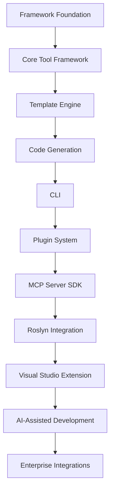

# MCPTools Roadmap

## 1. Purpose

This roadmap defines the planned evolution of **MCPTools**, an enterprise-grade open-source .NET 10 framework for building Model Context Protocol (MCP) tools and developer automation utilities.

The roadmap exists to:

- Communicate the long-term product direction.
- Help contributors understand upcoming priorities.
- Align architecture, documentation, and implementation work.
- Provide realistic release milestones.
- Preserve MCPTools' core principles of Clean Architecture, SOLID design, dependency injection, plugin-oriented extensibility, and AI provider independence.

This document is directional rather than a fixed contract. Priorities may change based on community feedback, MCP ecosystem changes, security requirements, and maintainer capacity.

## 2. Product Vision Timeline

### Evolution Strategy

MCPTools will evolve in phases:

1. Establish a stable core framework.
2. Add reusable tool infrastructure.
3. Build practical generation and automation tools.
4. Improve developer experience through CLI and templates.
5. Enable plugins and MCP server hosting support.
6. Add advanced code intelligence through Roslyn.
7. Support provider-neutral AI-assisted workflows.
8. Expand into enterprise integrations and multi-language automation.

## 3. Version 1.0 - Foundation

### Objectives

Version 1.0 establishes the stable foundation of MCPTools.

Primary objectives:

- Framework architecture.
- Tool infrastructure.
- Tool registry.
- Dependency injection.
- Logging.
- Configuration.
- Template Engine.
- Basic documentation.

### Deliverables

| Deliverable | Description |
| --- | --- |
| Core abstractions | Base contracts for tools, requests, responses, metadata, execution context, and results. |
| Tool lifecycle | Standardized initialization, validation, execution, logging, error handling, and cleanup flow. |
| Tool registry | Registration and lookup mechanism for available tools. |
| Dependency injection | `IServiceCollection` extension methods for registering framework components and tools. |
| Logging support | Centralized `ILogger<T>` usage and structured logging guidance. |
| Configuration support | Strongly typed options and configuration binding. |
| Template Engine foundation | Engine, loader, renderer, context, cache, and validation abstractions. |
| Documentation baseline | Vision, architecture, lifecycle, naming, coding standards, template engine, and MCP integration docs. |
| Unit test baseline | Initial tests for core framework behavior. |

### Success Criteria

- Core packages compile and pass tests.
- Tools can be registered through dependency injection.
- Tools can be discovered through the registry.
- A sample tool can execute without a live MCP client.
- Template rendering abstractions are usable from tests.
- Documentation clearly explains the framework architecture and contribution expectations.
- No dependency on a specific AI platform or MCP client exists in the core framework.

## 4. Version 1.1 - Code Generation

### Objectives

Version 1.1 introduces practical code generation tools built on the foundation from Version 1.0.

Included capabilities:

- CRUD Generator.
- Repository Generator.
- Service Generator.
- Controller Generator.
- DTO Generator.
- SQL Generator.
- Stored Procedure Generator.

### Deliverables

| Deliverable | Description |
| --- | --- |
| `GenerateCrudTool` | Generates coordinated CRUD artifacts from a structured request. |
| `GenerateRepositoryTool` | Generates repository interfaces and implementations. |
| `GenerateServiceTool` | Generates application service contracts and classes. |
| `GenerateControllerTool` | Generates API controller scaffolding. |
| `GenerateDtoTool` | Generates request and response DTOs. |
| `GenerateSqlTool` | Generates SQL scripts from models or schema metadata. |
| `GenerateStoredProcedureTool` | Generates stored procedure scripts for common operations. |
| C# templates | Templates for entities, DTOs, repositories, services, and controllers. |
| SQL templates | Templates for tables, queries, and stored procedures. |
| Snapshot tests | Golden-file tests for generated output. |

### Success Criteria

- Code generation tools produce deterministic output.
- Generated C# follows `CodingStandards.md` and `NamingConventions.md`.
- Generated SQL is configurable and testable.
- Tools support dry-run mode where appropriate.
- Templates can be overridden by users.
- Unit tests cover validation, success, and common failure paths.

## 5. Version 1.2 - Database Tools

### Objectives

Version 1.2 expands MCPTools into database analysis and generation workflows.

Included capabilities:

- Database Schema Reader.
- Migration Generator.
- Database Comparison.
- Reverse Engineering.
- SQL Analysis.

### Deliverables

| Deliverable | Description |
| --- | --- |
| Schema reader abstractions | Provider-neutral contracts for reading database metadata. |
| SQL Server provider | Optional initial provider for SQL Server schema inspection. |
| Migration generator | Generates migration plans or scripts from schema differences. |
| Database comparison tool | Compares schemas and reports differences. |
| Reverse engineering tool | Creates models or templates from existing database schemas. |
| SQL analyzer | Detects basic SQL risks, anti-patterns, and formatting issues. |
| Database models | Structured metadata for tables, columns, keys, indexes, and relationships. |

### Success Criteria

- Database tools are isolated from core framework abstractions.
- Read-only inspection is supported by default.
- Connection strings are never logged.
- Schema metadata can drive code and SQL generation tools.
- Database tools can be tested using fixtures or test containers where practical.

## 6. Version 2.0 - MCP Platform

### Objectives

Version 2.0 introduces platform-level capabilities for hosting, discovery, execution, and plugin-oriented expansion.

Included capabilities:

- MCP Server SDK.
- Tool Discovery.
- Tool Registration.
- Plugin Support.
- Async Execution.
- Parallel Execution.
- Tool Marketplace foundation.

### Deliverables

| Deliverable | Description |
| --- | --- |
| MCP server SDK | Optional package for exposing MCPTools tools through an MCP-compatible server. |
| Discovery metadata | Standard descriptor model for tools, schemas, categories, versions, and capabilities. |
| Registration conventions | Manual, automatic, and assembly-based registration patterns. |
| Plugin abstractions | Contracts for plugin metadata, loading, compatibility, and registration. |
| Async execution pipeline | Standardized asynchronous execution across tools. |
| Parallel execution support | Controlled execution model for concurrent or batched tool operations. |
| Marketplace metadata | Initial package metadata format for future tool marketplace support. |

### Success Criteria

- MCPTools remains usable without the MCP server SDK.
- Tool discovery works through stable metadata contracts.
- Plugin support does not require modifying `MCPTools.Core`.
- Async and cancellation behavior is consistent.
- Parallel execution avoids shared mutable state and respects cancellation.
- Version 2.0 preserves backward compatibility where practical.

## 7. Version 2.5 - Developer Experience

### Objectives

Version 2.5 improves developer productivity and onboarding.

Included capabilities:

- CLI.
- Interactive Console.
- Project Templates.
- Configuration Wizard.
- Scaffolding.

### Deliverables

| Deliverable | Description |
| --- | --- |
| `MCPTools.CLI` | Command-line interface for common framework workflows. |
| Interactive console | Local tool execution, testing, and diagnostics experience. |
| Project templates | `dotnet new` templates for tool projects and sample hosts. |
| Configuration wizard | Guided setup for options, templates, and local tool configuration. |
| Scaffolding commands | Generate new tools, requests, responses, tests, and templates. |
| Diagnostics commands | Validate tool registration, template availability, and configuration. |

### Success Criteria

- A new developer can create and run a tool from the CLI.
- Project templates follow architecture and coding standards.
- Scaffolding produces testable code.
- CLI commands are documented and covered by tests.
- Local diagnostics help identify common setup issues.

## 8. Version 3.0 - Roslyn

### Objectives

Version 3.0 adds advanced .NET code intelligence through Roslyn.

Included capabilities:

- Code Analysis.
- Refactoring.
- Source Generation.
- Syntax Tree Analysis.
- Diagnostics.

### Deliverables

| Deliverable | Description |
| --- | --- |
| `MCPTools.Roslyn` | Optional Roslyn integration package. |
| Syntax tree analyzer | Reads and analyzes C# syntax trees. |
| Semantic analyzer | Uses compilation metadata for deeper code understanding. |
| Refactoring tools | Provides safe code transformation primitives. |
| Source generation helpers | Supports structured generation of C# artifacts. |
| Diagnostics model | Reports code issues, suggestions, and metadata. |
| Project analysis integration | Connects Roslyn analysis with existing project analysis tools. |

### Success Criteria

- Roslyn support remains optional.
- Code analysis works on representative .NET solutions.
- Diagnostics are structured and machine-readable.
- Refactoring tools include safety checks and tests.
- Generated source follows MCPTools coding and naming standards.

## 9. Version 3.5 - AI Development

### Objectives

Version 3.5 introduces provider-neutral AI-assisted development utilities.

Included capabilities:

- AI Code Review.
- Documentation Generator.
- Prompt Templates.
- AI Suggestions.
- Code Explanation.

### Deliverables

| Deliverable | Description |
| --- | --- |
| AI utility abstractions | Provider-neutral contracts for AI-assisted workflows. |
| Prompt template system | Reusable prompt templates independent from any provider SDK. |
| Code review tool | Produces structured review prompts or provider-neutral review requests. |
| Documentation generator | Generates documentation from project metadata, templates, and optional AI assistance. |
| Suggestion model | Represents AI-generated suggestions in a structured, reviewable format. |
| Code explanation tool | Produces explanations using provider-neutral request and response models. |

### Success Criteria

- No specific AI provider is required by the core framework.
- AI workflows are optional and isolated.
- Prompt templates are versioned and testable.
- AI outputs are represented as structured suggestions, not blind code changes.
- Tools support human review before applying generated changes.

## 10. Version 4.0 - Enterprise

### Objectives

Version 4.0 expands MCPTools for enterprise automation and large-scale adoption.

Included capabilities:

- Cloud Support.
- Azure.
- AWS.
- GitHub Integration.
- CI/CD Integration.
- Security Analysis.
- Multi-language Support.

### Deliverables

| Deliverable | Description |
| --- | --- |
| Cloud abstractions | Provider-neutral interfaces for cloud metadata, storage, and deployment workflows. |
| Azure integration | Optional Azure-oriented tools and providers. |
| AWS integration | Optional AWS-oriented tools and providers. |
| GitHub integration | Repository, pull request, issue, and workflow automation tools. |
| CI/CD integration | Tools for pipeline inspection, generation, and diagnostics. |
| Security analysis | Tools for dependency, configuration, secret, and file system risk analysis. |
| Multi-language support | Initial support for non-.NET project analysis and generation workflows. |
| Enterprise policies | Configuration model for permissions, approval flows, and controlled execution. |

### Success Criteria

- Enterprise integrations are optional packages.
- Security-sensitive operations are explicit and auditable.
- Cloud integrations avoid hard dependency on one provider in the core.
- CI/CD tools can run in local and hosted environments.
- Multi-language features follow the same tool lifecycle and metadata model.

## 11. Future Ideas

| Idea | Description | Priority |
| --- | --- | --- |
| Visual Studio Extension | IDE integration for discovering, configuring, and running MCPTools tools. | High |
| JetBrains Rider Plugin | Rider integration for .NET developer automation. | Medium |
| VS Code Extension | Lightweight editor extension for tool discovery and execution. | High |
| Template Marketplace | Community-driven template discovery and installation. | Medium |
| NuGet Package Generator | Generate NuGet-ready package structure, metadata, and workflows. | Medium |
| API Documentation Generator | Generate API documentation from source, XML comments, and metadata. | High |
| Swagger Generator | Generate or enhance OpenAPI specifications. | Medium |
| Terraform Generator | Generate infrastructure-as-code templates from structured models. | Low |
| Kubernetes Generator | Generate Kubernetes manifests and deployment templates. | Low |
| GitHub Actions Generator | Generate CI/CD workflows for common project types. | Medium |
| Architecture Decision Record Tool | Create and manage ADR documents. | Medium |
| Dependency Analysis Tool | Analyze package dependencies, risks, and upgrade paths. | High |

Future ideas are candidates for discussion, prototypes, or community contribution. Inclusion in this table does not guarantee implementation.

## 12. Milestone Tracking

| Version | Status | Target | Priority |
| --- | --- | --- | --- |
| 1.0 - Foundation | Planned | Initial stable framework foundation | Critical |
| 1.1 - Code Generation | Planned | First practical generation toolset | High |
| 1.2 - Database Tools | Planned | Database metadata and SQL automation | High |
| 2.0 - MCP Platform | Planned | MCP hosting, plugins, discovery, async execution | Critical |
| 2.5 - Developer Experience | Planned | CLI, scaffolding, templates, diagnostics | High |
| 3.0 - Roslyn | Proposed | Advanced .NET code analysis and transformation | High |
| 3.5 - AI Development | Proposed | Provider-neutral AI-assisted workflows | Medium |
| 4.0 - Enterprise | Proposed | Cloud, CI/CD, security, multi-language automation | Medium |

### Status Definitions

| Status | Meaning |
| --- | --- |
| Planned | Accepted as part of the roadmap but not necessarily under active development. |
| In Progress | Actively being designed or implemented. |
| Preview | Available for early use with possible breaking changes. |
| Stable | Released and supported under compatibility guidelines. |
| Proposed | Under consideration and subject to design review. |

## 13. Contribution Opportunities

Open-source contributors can help MCPTools in many areas.

### Documentation

- Improve getting started guides.
- Add examples for tool development.
- Expand architecture and lifecycle documentation.
- Write migration and upgrade guides.
- Review documentation for clarity and consistency.

### Core Framework

- Improve tool abstractions.
- Add validation helpers.
- Enhance dependency injection registration.
- Improve error handling and diagnostics.
- Add test coverage for core behavior.

### Template Engine

- Add template examples.
- Improve template validation.
- Build snapshot tests.
- Prototype Scriban integration.
- Document template authoring patterns.

### Tooling

- Build sample tools.
- Add CLI commands.
- Improve project scaffolding.
- Add diagnostics and health checks.

### Integrations

- Prototype MCP server hosting.
- Explore plugin loading models.
- Create optional Roslyn tools.
- Add Git and CI/CD automation helpers.

### Quality

- Write unit and integration tests.
- Review pull requests.
- Improve performance benchmarks.
- Strengthen security validation.
- Report bugs with reproducible examples.

## 14. Guiding Principles

Roadmap decisions should follow these principles:

| Principle | Impact |
| --- | --- |
| Provider independence | Core framework features must not depend on a specific AI provider or client. |
| Clean Architecture | Protocol, infrastructure, and domain logic should remain separated. |
| Practical usefulness | Features should solve real developer automation problems. |
| Small stable core | Keep `MCPTools.Core` focused and move specialized capabilities into optional packages. |
| Testability | Features should be testable without requiring live AI clients or production infrastructure. |
| Security by default | File, database, network, and cloud operations should be explicit, validated, and safe. |
| Community extensibility | External contributors should be able to add tools and plugins without modifying the core. |
| Documentation first | Public features should include clear usage, architecture, and extension guidance. |

## 15. Summary

MCPTools is intended to grow from a focused .NET tool framework into a mature ecosystem for MCP-compatible developer automation.

The long-term vision is to provide:

- A stable, provider-agnostic core.
- A consistent lifecycle for tools.
- Reusable code generation and template capabilities.
- Database, project analysis, and documentation automation.
- A strong developer experience through CLI and scaffolding.
- Plugin-oriented extensibility.
- Optional MCP server hosting support.
- Roslyn-powered .NET code intelligence.
- Provider-neutral AI-assisted development workflows.
- Enterprise-grade cloud, CI/CD, security, and multi-language support.

MCPTools should help developers build durable automation once and use it across Claude Code, ChatGPT, GitHub Copilot, Cursor, VS Code, Visual Studio, JetBrains Rider, and future MCP-compatible environments without vendor lock-in.
