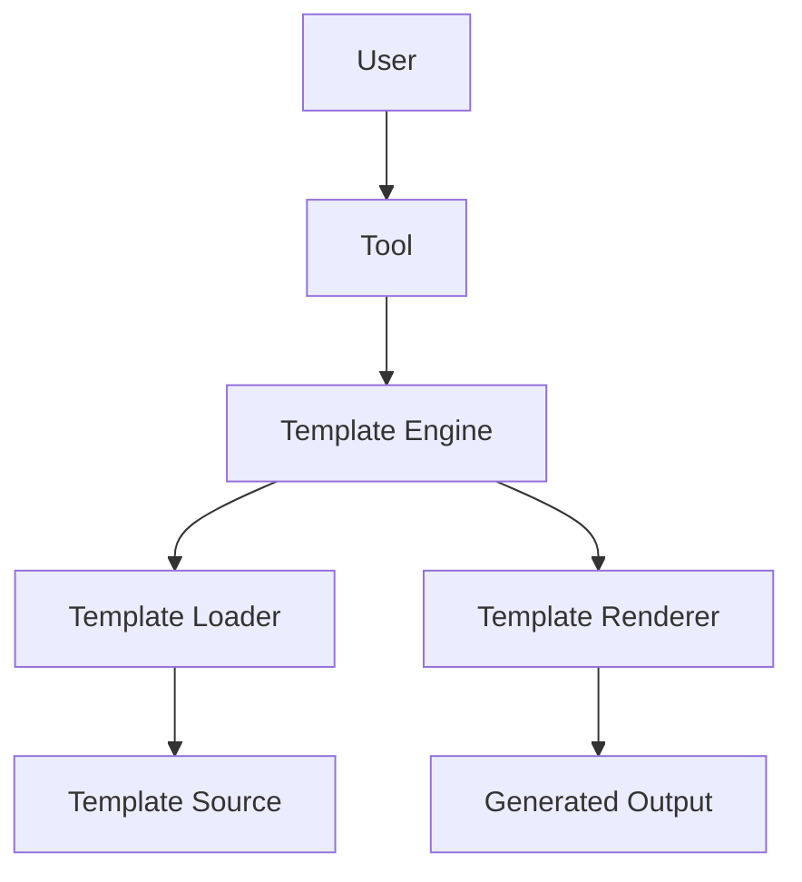
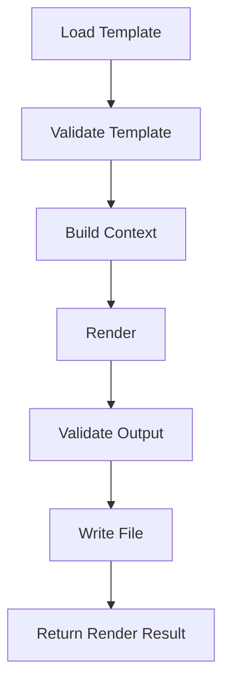
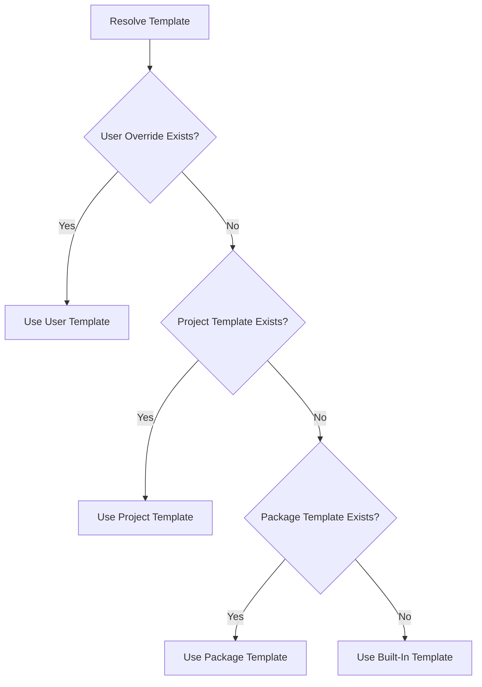

# MCPTools Template Engine

## 1. Purpose

The **MCPTools Template Engine** is responsible for generating source code, configuration files, documentation, SQL scripts, and other text-based artifacts from reusable templates.

The Template Engine exists to separate generation logic from generated content. Tools should decide **what** needs to be generated, while templates define **how** that output should look.

Template-driven generation provides several advantages:

- Keeps generated content consistent across tools and projects.
- Reduces repeated string-building logic in code.
- Makes output easier to review, customize, and version.
- Allows templates to evolve independently from business logic.
- Supports reusable generation workflows for code, documentation, SQL, and configuration.
- Enables future AI-assisted template creation and refinement.

The Template Engine is a core component of MCPTools, but it must remain independent, extensible, testable, and replaceable.

## 2. Design Goals

| Goal | Description |
| --- | --- |
| Reusable | Templates and rendering services should be reusable across multiple tools and projects. |
| Extensible | The engine should support new renderers, loaders, validators, template types, and future template languages. |
| Maintainable | Template logic should remain simple, documented, and separated from framework business logic. |
| High Performance | Frequently used templates should be loaded and rendered efficiently with optional caching. |
| Testable | Rendering behavior should be verifiable with unit tests and deterministic input/output snapshots. |
| AI Friendly | Templates should be structured so AI-assisted tools can inspect, generate, explain, and modify them safely. |

## 3. High-Level Architecture



### Component Responsibilities

| Component | Responsibility |
| --- | --- |
| User | Invokes an MCP tool through an MCP-compatible client or local host. |
| Tool | Coordinates the generation workflow and provides the template context. |
| Template Engine | Orchestrates loading, validation, context preparation, rendering, caching, and output validation. |
| Template Loader | Locates and loads template content from file system, embedded resources, packages, or future remote sources. |
| Template Renderer | Applies a context model to a template and produces rendered output. |
| Generated Output | The final artifact, such as C# code, Markdown documentation, SQL, JSON, YAML, XML, HTML, or plain text. |

### Architectural Intent

The Template Engine must not depend on a specific MCP client, AI platform, or host application. It should be usable from tools, CLI commands, tests, and future plugin packages.

## 4. Core Components

### Template Engine

The Template Engine is the main orchestration component.

Responsibilities:

- Accept template rendering requests.
- Resolve template identifiers.
- Load template content.
- Validate templates.
- Build or accept a template context.
- Render output.
- Validate rendered output.
- Use caching where configured.
- Return structured rendering results.

### Template Loader

The Template Loader retrieves template content from a source.

Supported and future sources may include:

- Local file system.
- Embedded resources.
- NuGet package content.
- User override folders.
- Remote repositories.
- Template marketplace packages.

The loader should hide the storage mechanism from tools.

### Template Renderer

The Template Renderer transforms a template and context into output.

Responsibilities:

- Parse template syntax.
- Bind context values.
- Execute loops and conditionals.
- Render final text.
- Report syntax or binding errors.

The renderer should be replaceable so MCPTools can support future engines such as Scriban without coupling the framework core to a single implementation.

### Template Cache

The Template Cache stores loaded or compiled templates to improve performance.

Responsibilities:

- Cache frequently used templates.
- Track cache keys and template versions.
- Support invalidation.
- Avoid unbounded memory growth.
- Respect development-time reload settings.

### Template Validator

The Template Validator checks template correctness before or during rendering.

Responsibilities:

- Detect invalid syntax.
- Detect missing required placeholders.
- Validate supported template features.
- Validate template metadata.
- Produce clear validation errors.

### Template Context

The Template Context contains the data passed to a template.

Responsibilities:

- Provide strongly typed values.
- Represent generation metadata.
- Expose collections for loops.
- Expose flags for conditionals.
- Avoid leaking infrastructure objects into templates.

### Template Manager

The Template Manager coordinates template discovery, organization, metadata, versioning, and overrides.

Responsibilities:

- Discover available templates.
- Resolve built-in versus user-defined templates.
- Track template categories and versions.
- Provide metadata for tooling and documentation.
- Support future plugin and marketplace scenarios.

## 5. Template Types

The Template Engine should support multiple text-based artifact types.

| Template Type | Purpose | Example Output |
| --- | --- | --- |
| C# Templates | Generate classes, interfaces, records, services, controllers, DTOs, and tests. | `.cs` |
| SQL Templates | Generate scripts, stored procedures, table definitions, views, and seed data. | `.sql` |
| HTML Templates | Generate static pages, reports, documentation fragments, or UI scaffolding. | `.html` |
| Markdown Templates | Generate README files, architecture notes, changelogs, and documentation. | `.md` |
| JSON Templates | Generate configuration, manifests, schemas, and structured metadata. | `.json` |
| YAML Templates | Generate CI/CD files, deployment manifests, and configuration. | `.yml`, `.yaml` |
| XML Templates | Generate project files, configuration files, and metadata documents. | `.xml`, `.csproj` |
| Text Templates | Generate plain text files, prompts, scripts, and generic artifacts. | `.txt` |

The core rendering model should treat all template types as text while allowing specialized validators or formatters for specific output types.

## 6. Template Folder Structure

Recommended folder structure:

```text
Templates/
|-- CSharp/
|   |-- Controller/
|   |-- Service/
|   |-- Repository/
|   |-- DTO/
|   |-- Entity/
|-- SQL/
|   |-- StoredProcedures/
|   |-- Tables/
|   |-- Views/
|-- Documentation/
|-- Configuration/
```

### Folder Responsibilities

| Folder | Purpose |
| --- | --- |
| `Templates/` | Root folder for built-in or user-defined templates. |
| `Templates/CSharp/` | C# source generation templates. |
| `Templates/CSharp/Controller/` | API or MVC controller templates. |
| `Templates/CSharp/Service/` | Application service templates. |
| `Templates/CSharp/Repository/` | Repository and persistence abstraction templates. |
| `Templates/CSharp/DTO/` | Data transfer object templates. |
| `Templates/CSharp/Entity/` | Domain entity and model templates. |
| `Templates/SQL/` | SQL script templates. |
| `Templates/SQL/StoredProcedures/` | Stored procedure templates. |
| `Templates/SQL/Tables/` | Table creation or migration templates. |
| `Templates/SQL/Views/` | Database view templates. |
| `Templates/Documentation/` | Markdown, text, or HTML documentation templates. |
| `Templates/Configuration/` | JSON, YAML, XML, and application configuration templates. |

Template folders should be organized by artifact type first, then by artifact responsibility.

## 7. Placeholder Syntax

MCPTools should support placeholder-based rendering. The exact rendering engine is replaceable, but the recommended future syntax is compatible with Scriban-style templates.

### Basic Placeholders

```sbn
namespace {{ namespace }}
{
    public sealed class {{ class_name }}
    {
    }
}
```

### Example Placeholder Names

| Placeholder | Purpose |
| --- | --- |
| `class_name` | Name of the generated C# class. |
| `namespace` | Target namespace. |
| `properties` | Collection of generated properties. |
| `methods` | Collection of generated methods. |
| `database_name` | Target database name. |
| `table_name` | Target table name. |
| `primary_key` | Primary key column or property. |
| `columns` | Collection of database columns. |

Template placeholders may map from strongly typed .NET context properties.

Example C# context:

```csharp
public sealed class CSharpClassTemplateContext
{
    public required string ClassName { get; init; }
    public required string Namespace { get; init; }
    public IReadOnlyList<PropertyTemplateModel> Properties { get; init; } = [];
    public IReadOnlyList<MethodTemplateModel> Methods { get; init; } = [];
}
```

The renderer may expose these values using template-friendly naming such as `class_name`, `namespace`, `properties`, and `methods`.

### Loops

Scriban-style loop example:

```sbn
{{ for property in properties }}
public {{ property.type }} {{ property.name }} { get; set; }
{{ end }}
```

### Conditional Rendering

```sbn
{{ if include_repository }}
private readonly I{{ entity_name }}Repository _repository;
{{ end }}
```

### SQL Example

```sbn
CREATE TABLE {{ table_name }} (
{{ for column in columns }}
    {{ column.name }} {{ column.sql_type }}{{ if column.is_required }} NOT NULL{{ end }},
{{ end }}
    CONSTRAINT PK_{{ table_name }} PRIMARY KEY ({{ primary_key }})
);
```

Templates should remain declarative. Complex business rules should be evaluated before rendering and passed into the template context.

## 8. Rendering Process

The rendering pipeline should be consistent across all template types.



### Pipeline Stages

| Stage | Responsibility |
| --- | --- |
| Load Template | Resolve the template name and load template content from the configured source. |
| Validate Template | Check syntax, metadata, required placeholders, and supported features. |
| Build Context | Create a strongly typed context object containing all values needed by the template. |
| Render | Apply the context to the template and produce generated text. |
| Validate Output | Verify that rendered output is not empty, malformed, or missing required generated sections. |
| Write File | Persist output through a file system abstraction when requested by the tool. |
| Return Render Result | Return metadata such as output content, file path, warnings, and diagnostics. |

### Example Rendering API

```csharp
public interface ITemplateEngine
{
    ValueTask<TemplateRenderResult> RenderAsync<TContext>(
        TemplateRenderRequest<TContext> request,
        CancellationToken cancellationToken = default);
}
```

### Example Render Request

```csharp
public sealed class TemplateRenderRequest<TContext>
{
    public required string TemplateName { get; init; }
    public required TContext Context { get; init; }
    public string? OutputPath { get; init; }
    public bool WriteToFile { get; init; }
}
```

## 9. Template Context

Template context is how data is passed from tools and services into templates.

Context objects should be strongly typed. Strong typing improves:

- Compile-time safety.
- Refactoring support.
- Validation.
- Testability.
- Documentation.
- AI-assisted analysis.

### Context Example

```csharp
public sealed class CrudTemplateContext
{
    public required string EntityName { get; init; }
    public required string Namespace { get; init; }
    public IReadOnlyList<PropertyTemplateModel> Properties { get; init; } = [];
    public bool IncludeRepository { get; init; }
    public bool IncludeService { get; init; }
    public bool IncludeController { get; init; }
}
```

### Context Guidelines

- Keep context objects specific to a template family.
- Avoid passing domain entities directly when a smaller template model is sufficient.
- Avoid passing service instances, database connections, file handles, or host-specific objects.
- Precompute complex decisions before rendering.
- Prefer simple scalar values and collections.

## 10. Template Caching

Template caching improves performance by avoiding repeated file reads, parsing, or compilation.

### Benefits

- Reduces disk access.
- Improves repeated rendering performance.
- Enables reuse of parsed or compiled templates.
- Reduces overhead for batch generation.

### Cache Invalidation

Template cache invalidation may be based on:

- File timestamp.
- Template version.
- Content hash.
- Development-mode reload settings.
- Manual cache clear operation.

### Memory Considerations

The cache should:

- Avoid unbounded growth.
- Support size limits where appropriate.
- Store immutable template representations.
- Be thread-safe for concurrent rendering.
- Provide observability for cache hits and misses.

Example cache contract:

```csharp
public interface ITemplateCache
{
    bool TryGet(string cacheKey, out CachedTemplate template);
    void Set(string cacheKey, CachedTemplate template);
    void Remove(string cacheKey);
    void Clear();
}
```

## 11. Template Validation

Template validation ensures that templates are safe and usable before output is generated.

### Validation Areas

| Area | Description |
| --- | --- |
| Missing placeholders | Required placeholders are not present in the context. |
| Invalid syntax | Template syntax cannot be parsed by the renderer. |
| Unsupported features | Template uses functions or directives disabled by MCPTools policy. |
| Empty output | Rendering produced no meaningful content. |
| Invalid output format | Generated JSON, YAML, XML, SQL, or C# is malformed when format validation is enabled. |
| Unsafe output path | Requested output path violates workspace or security rules. |

### Validation Errors

Validation errors should be clear and actionable.

Example:

```text
Template 'crud-controller.sbn' requires placeholder 'entity_name', but the context did not provide it.
```

Validation should fail before writing files whenever possible.

## 12. Future Scriban Integration

Scriban is the recommended future template engine for MCPTools because it is:

- Mature and widely used in the .NET ecosystem.
- Fast and suitable for code generation.
- Safe for text-based templates when configured carefully.
- Friendly to loops, conditionals, filters, and template functions.
- Easy to test with deterministic input and output.

MCPTools should not require Scriban in the earliest core abstractions. Instead, the framework should define renderer interfaces that allow Scriban to be added as an implementation package.

Possible future package:

```text
MCPTools.Templates.Scriban
```

Example registration:

```csharp
services
    .AddMcpTools()
    .AddTemplateEngine()
    .AddScribanRenderer();
```

This preserves Clean Architecture by keeping the core template contracts independent from a specific rendering library.

## 13. Custom Templates

Users should be able to override built-in templates with custom templates.

### Override Strategy

The Template Manager should resolve templates in priority order:

1. User-provided template path.
2. Project-level template path.
3. Package-provided template path.
4. Built-in default template.



### Version Compatibility

Custom templates should declare or imply compatibility with a template contract version.

Version compatibility may include:

- Required placeholder names.
- Supported context model version.
- Expected output type.
- Minimum MCPTools version.
- Template engine version.

Template changes that break context compatibility should be versioned and documented.

## 14. Best Practices

| Practice | Recommendation |
| --- | --- |
| Small templates | Keep templates focused on one generated artifact. |
| Reusable partials | Use partials for repeated sections such as headers, properties, methods, or comments. |
| Naming conventions | Follow `NamingConventions.md` for template file names and generated artifacts. |
| Versioning | Version templates when context contracts change. |
| Documentation | Document expected context values and generated output. |
| Deterministic output | Avoid non-deterministic values unless explicitly provided by the context. |
| Minimal logic | Keep business decisions in tools or services, not templates. |
| Testing | Add snapshot or golden-file tests for important templates. |

### Template Header Example

```sbn
{{-
    Template: crud-controller.sbn
    Purpose: Generates an API controller for an entity.
    Context: CrudTemplateContext
-}}
```

### Generated Code Example

```sbn
namespace {{ namespace }};

public sealed class {{ entity_name }}Controller
{
{{ for method in methods }}
    public {{ method.return_type }} {{ method.name }}()
    {
        {{ method.body }}
    }
{{ end }}
}
```

## 15. Anti-Patterns

| Anti-Pattern | Problem |
| --- | --- |
| Business logic inside templates | Makes templates hard to test, review, and reuse. |
| Hardcoded values | Reduces portability and forces manual edits after generation. |
| Duplicate templates | Increases maintenance cost and causes inconsistent output. |
| Large monolithic templates | Makes changes risky and discourages reuse. |
| Infrastructure objects in context | Couples templates to services, hosts, or runtime state. |
| Undocumented placeholders | Makes templates difficult to customize safely. |
| Writing files directly from renderers | Mixes rendering with file system concerns. |
| Ignoring validation errors | Allows broken output to be generated. |
| Provider-specific assumptions | Breaks MCPTools platform independence. |

## 16. Future Enhancements

MCPTools should keep the Template Engine open to future capabilities.

| Enhancement | Description |
| --- | --- |
| Template Marketplace | Discover and install reusable templates from trusted sources. |
| Remote Templates | Load templates from Git repositories, package feeds, or secure remote sources. |
| AI-generated Templates | Use provider-neutral AI utilities to propose or refine templates. |
| Visual Template Designer | Provide a visual authoring experience for template structure and context mapping. |
| Template Versioning | Track template contract versions and compatibility rules. |
| Template Diffing | Compare custom templates against updated built-in templates. |
| Template Diagnostics | Provide warnings, suggestions, and validation reports for template authors. |
| Multi-engine Support | Support Scriban and other renderers through replaceable renderer implementations. |

Future enhancements must preserve the same architectural principle: the core framework defines contracts and orchestration, while optional packages provide specialized implementations.

## 17. Summary

The MCPTools Template Engine is designed to make generated artifacts consistent, maintainable, customizable, and testable.

Its philosophy is:

- Keep business logic in tools and services.
- Keep generated content in templates.
- Pass data through strongly typed context objects.
- Validate before writing output.
- Cache carefully for performance.
- Support user customization without compromising framework stability.
- Remain independent from any specific AI platform or template rendering library.

This design allows MCPTools to support practical code generation today while remaining ready for future template engines, marketplaces, AI-assisted authoring, and enterprise-grade customization.
