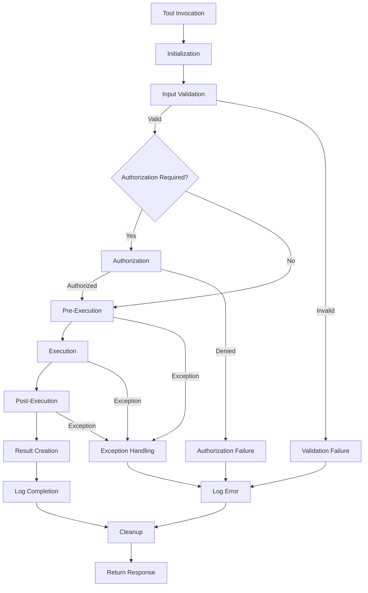
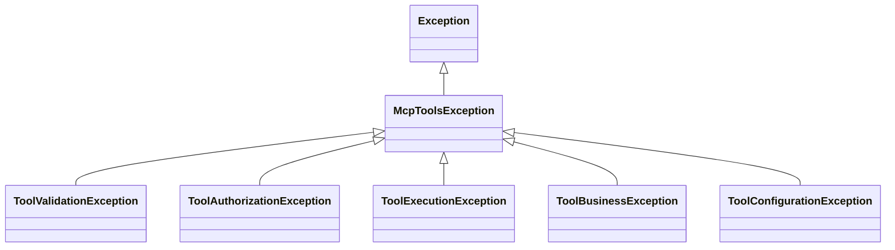
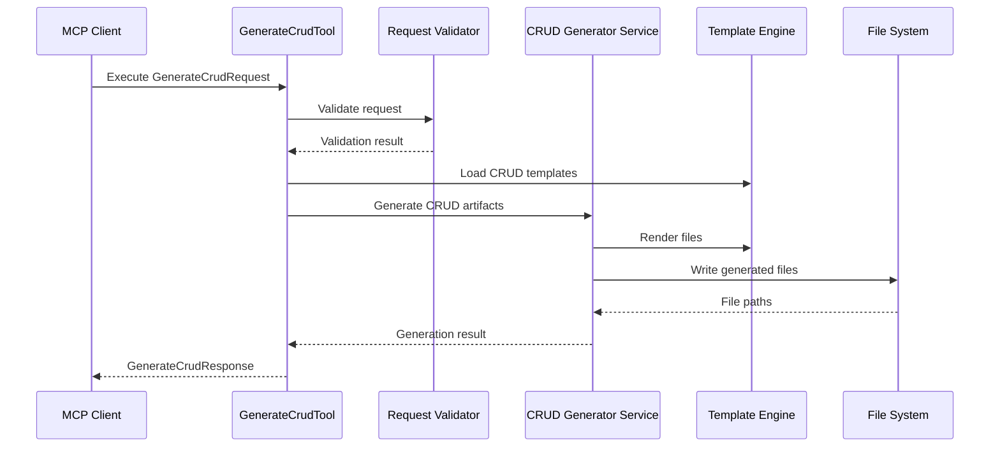

# MCPTools Tool Lifecycle

## 1. Purpose

This document defines the official lifecycle for tools built with **MCPTools**.

A standardized lifecycle ensures that every tool behaves consistently across hosts, MCP servers, and MCP-compatible clients. It also makes tools easier to understand, test, extend, monitor, and maintain.

The lifecycle exists to provide:

- Predictable execution behavior.
- Consistent validation and error handling.
- Centralized logging and diagnostics.
- Clear separation between framework responsibilities and tool-specific logic.
- Support for synchronous and asynchronous execution.
- A foundation for future features such as authorization, middleware, plugins, parallel execution, and distributed execution.

## 2. Tool Definition

In MCPTools, a **Tool** is a reusable .NET component that exposes a specific developer automation capability through the Model Context Protocol.

A tool receives a structured request, performs a well-defined operation, and returns a structured response.

Examples of tools include:

- `GenerateCrudTool`
- `AnalyzeProjectTool`
- `GenerateDocumentationTool`
- `InspectDatabaseSchemaTool`
- `RenderTemplateTool`
- `SearchFilesTool`

### Tool Responsibilities

| Responsibility | Description |
| --- | --- |
| Define contract | Declare request and response models for the tool. |
| Validate input | Ensure required input is present and semantically valid. |
| Coordinate execution | Orchestrate services needed to complete the operation. |
| Return results | Produce a structured response that can be serialized through MCP. |
| Report failures | Convert known failures into predictable exceptions or error responses. |
| Emit diagnostics | Log meaningful execution information without exposing sensitive data. |

### Tool Boundaries

A tool should:

- Represent one clear capability.
- Delegate reusable business logic to services.
- Avoid direct dependency on a specific AI client.
- Avoid embedding transport, hosting, or protocol-specific assumptions in domain logic.
- Be testable without requiring a live MCP client.

A tool should not:

- Act as a general-purpose service container.
- Mix unrelated workflows.
- Own long-lived infrastructure resources directly.
- Hide dependencies through service location.
- Return unstructured or ambiguous results.

## 3. Tool Lifecycle

Every MCPTools tool follows the same conceptual lifecycle:

1. Initialization
2. Input Validation
3. Authorization (optional)
4. Pre-Execution
5. Execution
6. Post-Execution
7. Result Creation
8. Logging
9. Exception Handling
10. Cleanup

### Lifecycle Stages

| Stage | Required | Responsibility |
| --- | --- | --- |
| Initialization | Yes | Resolve dependencies, prepare execution context, and load configuration. |
| Input Validation | Yes | Validate request structure, required values, and business rules that can be checked before execution. |
| Authorization | Optional | Determine whether the caller or execution context is allowed to invoke the tool. |
| Pre-Execution | Optional | Run setup logic, normalize inputs, enrich context, or execute lifecycle hooks. |
| Execution | Yes | Perform the primary tool operation. |
| Post-Execution | Optional | Run follow-up logic, collect metadata, publish diagnostics, or transform intermediate results. |
| Result Creation | Yes | Create the final response object returned to the MCP server or host. |
| Logging | Yes | Log start, end, duration, warnings, and failures using structured logging. |
| Exception Handling | Yes | Classify known and unknown failures and translate them into safe framework-level outcomes. |
| Cleanup | Yes | Release temporary resources and dispose execution-scoped objects where required. |

### 3.1 Initialization

Initialization prepares the tool for execution.

This stage may include:

- Resolving constructor-injected dependencies.
- Reading strongly typed options.
- Creating an execution context.
- Assigning correlation or request identifiers.
- Loading tool metadata.

Initialization should be lightweight. Heavy work should be deferred to execution or a dedicated service.

### 3.2 Input Validation

Input validation verifies that the request can be executed.

Validation should check:

- Required fields.
- String length and format.
- File and directory path rules.
- Allowed enum values.
- Compatible option combinations.
- Business rules that can be evaluated before execution.

Validation failures should stop execution before side effects occur.

### 3.3 Authorization

Authorization is optional and depends on the host, server, and tool category.

This stage may check:

- Caller identity.
- Workspace permissions.
- File system access.
- Database access.
- Allowed operations.
- Policy-based restrictions.

Authorization should be implemented through abstractions so MCPTools remains independent of any specific identity provider or AI client.

### 3.4 Pre-Execution

Pre-execution provides a safe extension point before the primary operation runs.

Examples:

- Normalize request values.
- Resolve project paths.
- Create temporary working directories.
- Load templates.
- Start timers.
- Execute `BeforeExecute` hooks.

Pre-execution should not contain the primary business operation.

### 3.5 Execution

Execution performs the tool's primary responsibility.

Examples:

- Generate source files.
- Analyze a solution.
- Inspect database schema.
- Render documentation.
- Search the file system.

Execution should delegate reusable logic to services. A tool should orchestrate the operation, not become a large procedural script.

### 3.6 Post-Execution

Post-execution runs after the primary operation succeeds.

Examples:

- Collect generated file metadata.
- Format summary information.
- Emit metrics.
- Run `AfterExecute` hooks.
- Prepare response diagnostics.

Post-execution should avoid introducing new side effects unless they are part of the documented tool behavior.

### 3.7 Result Creation

Result creation converts execution output into a structured response model.

A response should include:

- Success status.
- Primary result data.
- Warnings.
- Diagnostic metadata.
- Optional generated artifact references.
- Safe error information when applicable.

Responses should be deterministic and serializable.

### 3.8 Logging

Logging occurs throughout the lifecycle, but should be coordinated consistently.

At minimum, tools should log:

- Start of execution.
- End of execution.
- Duration.
- Validation failures.
- Warnings.
- Exceptions.

Logging must use `ILogger<T>` and structured message templates.

### 3.9 Exception Handling

Exception handling classifies failures and ensures callers receive safe, useful outcomes.

Known exceptions should be handled explicitly. Unexpected exceptions should be logged and translated at the framework boundary.

### 3.10 Cleanup

Cleanup releases temporary or execution-scoped resources.

Examples:

- Delete temporary files.
- Dispose streams.
- Release locks.
- Clear execution context state.
- Cancel pending work when cancellation is requested.

Cleanup should run even when execution fails.

## 4. Lifecycle Flow Diagram



## 5. Request and Response Model

Every tool should accept a single request object and return a single response object.

```csharp
public interface IMcpTool<TRequest, TResponse>
{
    ValueTask<TResponse> ExecuteAsync(
        TRequest request,
        CancellationToken cancellationToken = default);
}
```

### Request Models

A request model represents all input required by a tool.

Request models should:

- Be explicit and strongly typed.
- Be serializable.
- Contain validation-friendly properties.
- Avoid hidden dependencies.
- Include optional execution metadata only when needed.

Example:

```csharp
public sealed class GenerateCrudRequest
{
    public required string EntityName { get; init; }
    public required string OutputPath { get; init; }
    public string? Namespace { get; init; }
    public bool IncludeRepository { get; init; } = true;
    public bool IncludeController { get; init; } = true;
}
```

### Response Models

A response model represents the outcome of a tool execution.

Response models should:

- Be structured and serializable.
- Include generated artifacts or result data.
- Include warnings when appropriate.
- Avoid leaking sensitive internal details.
- Be stable enough for MCP clients and tests to consume.

Example:

```csharp
public sealed class GenerateCrudResponse
{
    public bool Succeeded { get; init; }
    public IReadOnlyList<string> GeneratedFiles { get; init; } = [];
    public IReadOnlyList<string> Warnings { get; init; } = [];
    public TimeSpan Duration { get; init; }
}
```

### Avoid Primitive Parameters

Primitive parameters should be avoided for tool execution methods.

Instead of:

```csharp
GenerateCrud("Customer", "src/Domain", true, false);
```

Prefer:

```csharp
await generateCrudTool.ExecuteAsync(new GenerateCrudRequest
{
    EntityName = "Customer",
    OutputPath = "src/Domain",
    IncludeRepository = true,
    IncludeController = false
}, cancellationToken);
```

Request objects are preferred because they:

- Improve readability.
- Support versioning.
- Make validation easier.
- Reduce parameter ordering mistakes.
- Support optional fields without overload explosion.
- Map naturally to MCP input schemas.

## 6. Validation Strategy

Validation is responsible for determining whether a request is safe and meaningful to execute.

### Validation Responsibilities

| Area | Examples |
| --- | --- |
| Structural validation | Required fields, null checks, empty strings, valid enum values. |
| Semantic validation | Compatible options, valid entity names, supported project type. |
| Environment validation | Output path exists, template exists, database connection is configured. |
| Safety validation | Prevent path traversal, destructive operations, unsupported file locations. |

### Validation Failures vs Execution Failures

| Failure Type | Meaning | Example | Expected Handling |
| --- | --- | --- | --- |
| Validation failure | Request is invalid before execution begins. | Missing `EntityName`. | Throw or return a validation error before side effects occur. |
| Execution failure | Request was valid, but execution failed. | File write failed due to locked file. | Log error, throw a tool execution exception, or return a failed response. |

Validation should be deterministic and should not perform expensive business operations.

## 7. Error Handling

MCPTools should use a consistent exception model for tool failures.



### Expected Exceptions

Expected exceptions represent known failure conditions that the tool or framework can classify.

Examples:

- Invalid request data.
- Missing template.
- Unsupported operation.
- Authorization failure.
- Configuration error.

### Unexpected Exceptions

Unexpected exceptions represent unplanned runtime failures.

Examples:

- Unhandled I/O exception.
- Serialization failure.
- Null reference caused by a defect.
- Third-party library failure.

Unexpected exceptions should be logged with diagnostic context and translated into safe error output.

### Business Exceptions

Business exceptions represent domain-specific rules that prevent successful execution.

Example:

- A CRUD generator cannot generate a repository because the selected project type does not support repositories.

### Validation Exceptions

Validation exceptions represent invalid input or invalid preconditions.

Example:

- `EntityName` is empty.
- `OutputPath` is outside the allowed workspace.

Validation exceptions should be clear and actionable.

## 8. Logging Strategy

Tool execution should use centralized structured logging through `ILogger<T>`.

### Required Logging Events

| Event | Description |
| --- | --- |
| Start | Log the tool name, request identifier, and safe execution context. |
| End | Log successful completion. |
| Duration | Log elapsed execution time for diagnostics and performance tracking. |
| Errors | Log exceptions with classification and correlation data. |
| Warnings | Log recoverable concerns, skipped optional steps, or degraded behavior. |

Example:

```csharp
logger.LogInformation(
    "Starting tool {ToolName} with request id {RequestId}",
    toolName,
    requestId);

logger.LogInformation(
    "Completed tool {ToolName} in {DurationMs} ms",
    toolName,
    duration.TotalMilliseconds);
```

Logs must not include secrets, credentials, tokens, private source code, or sensitive user data unless explicitly allowed by the host application.

## 9. Execution Modes

### Synchronous Execution

Synchronous execution is appropriate for lightweight, CPU-bound operations that complete quickly and do not depend on asynchronous I/O.

Synchronous tools should still fit into the same lifecycle and may be adapted into asynchronous execution by the framework.

### Asynchronous Execution

Asynchronous execution is preferred for tools that perform:

- File I/O.
- Database access.
- Network calls.
- Template loading.
- Long-running analysis.
- External process execution.

Asynchronous tools should accept a `CancellationToken` and honor cancellation where possible.

### Future Parallel Execution

Future framework versions may support parallel or batched tool execution.

Parallel execution requires:

- Stateless or execution-scoped tool instances.
- Thread-safe services.
- Clear resource ownership.
- Cancellation support.
- Deterministic result aggregation.
- Isolation between concurrent requests.

Tools should avoid mutable static state so they remain compatible with future parallel execution.

## 10. Extension Points

The lifecycle should support extension points without requiring developers to rewrite framework execution logic.

### Common Extension Points

| Extension Point | Timing | Purpose |
| --- | --- | --- |
| `BeforeValidate` | Before validation | Normalize input or enrich context before validation. |
| `AfterValidate` | After validation | Record validation metadata or prepare authorization checks. |
| `BeforeExecute` | Before execution | Prepare resources, resolve templates, or start custom diagnostics. |
| `AfterExecute` | After execution | Transform results, publish metrics, or add response metadata. |
| `OnError` | When an exception occurs | Classify, log, translate, or enrich error information. |
| `OnCleanup` | End of lifecycle | Release tool-specific resources. |

### Example Hook Shape

```csharp
public abstract class McpToolBase<TRequest, TResponse>
{
    protected virtual ValueTask BeforeExecuteAsync(
        TRequest request,
        ToolExecutionContext context,
        CancellationToken cancellationToken) => ValueTask.CompletedTask;

    protected virtual ValueTask AfterExecuteAsync(
        TRequest request,
        TResponse response,
        ToolExecutionContext context,
        CancellationToken cancellationToken) => ValueTask.CompletedTask;

    protected virtual ValueTask OnErrorAsync(
        TRequest request,
        Exception exception,
        ToolExecutionContext context,
        CancellationToken cancellationToken) => ValueTask.CompletedTask;
}
```

Extension points should be optional and should have safe default behavior.

## 11. Best Practices

- Define one request model and one response model per tool.
- Keep tool names clear, stable, and action-oriented.
- Keep tools focused on orchestration.
- Move reusable logic into services.
- Use constructor injection for all dependencies.
- Use strongly typed options for configuration.
- Validate requests before side effects occur.
- Support asynchronous execution for I/O-bound work.
- Accept and honor `CancellationToken`.
- Use structured logging.
- Avoid logging sensitive data.
- Return deterministic, serializable responses.
- Add unit tests for validation, success paths, and failure paths.
- Keep framework-level abstractions independent from specific AI clients.

## 12. Anti-Patterns

| Anti-Pattern | Why It Should Be Avoided |
| --- | --- |
| Primitive parameter lists | They are hard to version, hard to validate, and easy to call incorrectly. |
| Tool classes with many responsibilities | They become difficult to test, maintain, and reuse. |
| Direct dependency on an AI client SDK | It breaks platform independence. |
| Service locator usage | It hides dependencies and weakens testability. |
| Mutable static state | It creates concurrency risks and blocks future parallel execution. |
| Logging raw request payloads | It may expose secrets, source code, or private user data. |
| Throwing generic exceptions for known failures | It makes error handling inconsistent and less actionable. |
| Performing side effects during validation | It makes validation unpredictable and hard to test. |
| Swallowing exceptions silently | It hides failures and makes diagnostics unreliable. |
| Returning unstructured strings for complex results | It makes responses hard for MCP clients and tests to consume. |

## 13. Example Lifecycle

This section describes an example lifecycle for `GenerateCrudTool`.

### Scenario

`GenerateCrudTool` generates CRUD-related source files for an entity such as `Customer`.

### Request

```csharp
public sealed class GenerateCrudRequest
{
    public required string EntityName { get; init; }
    public required string OutputPath { get; init; }
    public string? Namespace { get; init; }
    public bool IncludeRepository { get; init; } = true;
    public bool IncludeService { get; init; } = true;
    public bool IncludeController { get; init; } = true;
}
```

### Response

```csharp
public sealed class GenerateCrudResponse
{
    public bool Succeeded { get; init; }
    public IReadOnlyList<string> GeneratedFiles { get; init; } = [];
    public IReadOnlyList<string> SkippedFiles { get; init; } = [];
    public IReadOnlyList<string> Warnings { get; init; } = [];
    public TimeSpan Duration { get; init; }
}
```

### Lifecycle Walkthrough

| Stage | GenerateCrudTool Behavior |
| --- | --- |
| Initialization | Resolve generator services, template renderer, file system abstraction, logger, and options. |
| Input Validation | Validate `EntityName`, `OutputPath`, namespace format, and selected generation options. |
| Authorization | Confirm write access to the target workspace if authorization is enabled by the host. |
| Pre-Execution | Normalize paths, load CRUD templates, and create an execution context. |
| Execution | Generate entity, repository, service, and controller files based on request options. |
| Post-Execution | Collect generated file paths and warnings for skipped optional files. |
| Result Creation | Return a `GenerateCrudResponse` containing generated files, skipped files, warnings, and duration. |
| Logging | Log start, selected options, generated file count, warnings, duration, and failures. |
| Exception Handling | Convert validation problems to `ToolValidationException` and file generation failures to `ToolExecutionException`. |
| Cleanup | Remove temporary files and release any execution-scoped resources. |

### Flow



## 14. Summary

The MCPTools lifecycle defines a consistent execution model for every tool in the framework.

Each tool should be structured around clear request and response models, deterministic validation, optional authorization, predictable execution, centralized logging, classified error handling, and reliable cleanup.

The lifecycle philosophy is simple: **tools should be small, explicit, testable orchestration components that expose reusable .NET capabilities through MCP without depending on any specific AI platform**.

By following this lifecycle, MCPTools can support current tool development needs while remaining ready for future capabilities such as plugins, middleware, parallel execution, hosted MCP servers, and provider-neutral AI integrations.
